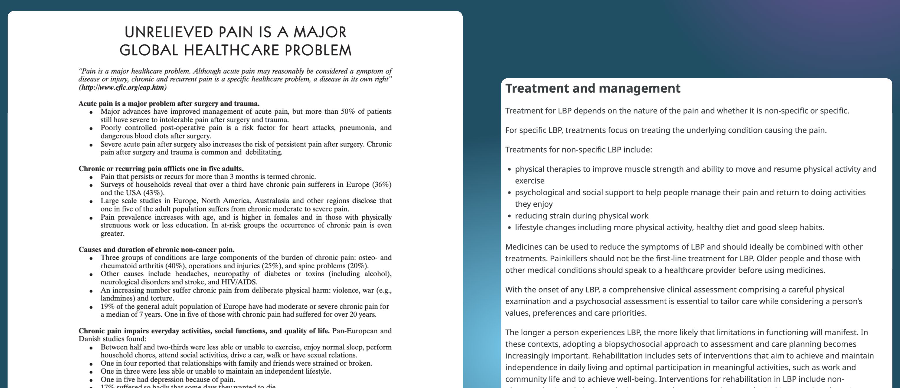
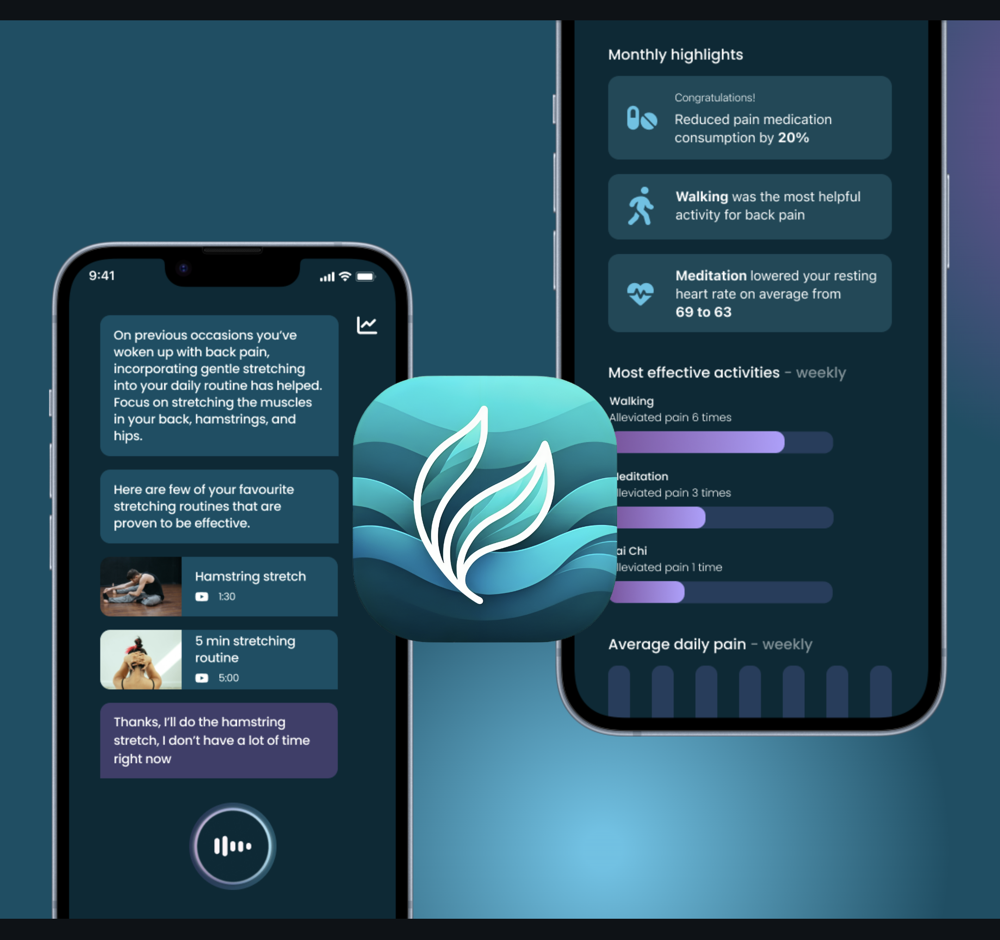

# [Hilja App](https://hilja.app/)

This repository hosts ✨[Hilja App](https://hilja.app/)✨ built for [Junction 2023 Hackathon](https://eu.junctionplatform.com/dashboard/event/junction-2023), for the challenge related to chronic pain and treatments related to it.

# Why
We're excited to introduce Hilja – a AI powered solution that provides personalised approach to pain relief, reducing the need for medication.
Chronic pain affects 20 percent of the global population, impacting daily life, and self reliance on pain relievers has created social challenges.
Medication, while common, is not a one-size-fits-all solution.
The amount of people affected is estimated to increase almost 50% in the next 30 years.
Based on several medical professionals we interviewed, there is a need for a solution that integrates seamlessly to medical patient journey, educating and promoting personalized pain relief methods.

# Solution
Meet Hilja: designed specifically for digitally-savvy individuals aged 25 to 35.
Our app revolutionizes chronic pain management with its user-friendly conversational interface, serving as your dedicated pain management companion.
In a world where tens of millions of people in this age group grapple with daily pain, Hilja offers a medication free approach.
By monitoring your pain and activity levels, it encourages gentle, personalized methods to alleviate discomfort, with medication as a last resort.
Over time, Hilja learns more about you, enhancing the accuracy of its recommendations.
As your AI companion, Hilja's training incorporates current medical knowledge and the most effective techniques for managing chronic pain.
Additionally, it empowers healthcare professionals by providing valuable insights into treatment effectiveness and patient responses.

# Goals

Imagine a world where chronic pain is no longer a barrier to a vibrant life.
Hilja offers innovative, cost-effective tools to manage pain, enhancing global health.
We're revolutionizing the healthcare experience, providing patients and professionals with smart, non-pharmaceutical solutions.
Hilja aims to alleviate the financial burden on healthcare systems, paving the way for healthier communities worldwide.

Hilja syncs seamlessly with everyday applications to understand your daily life.
This personalized data, crucial in managing chronic pain, can be securely shared with your medical professionals, integrating effortlessly into their systems.

Join us on a journey to better health.
Hilja – your smart partner in managing chronic pain.
